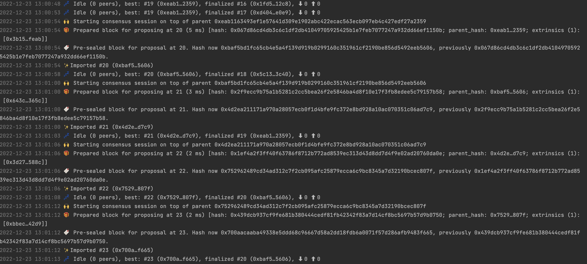
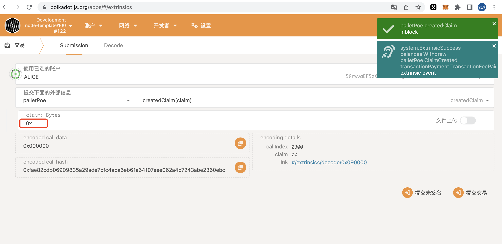
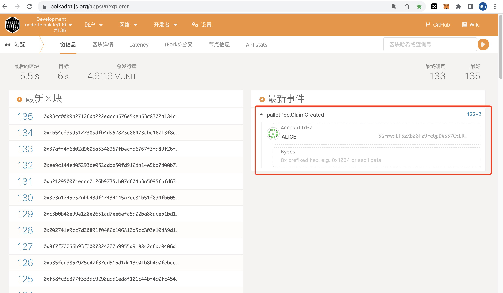
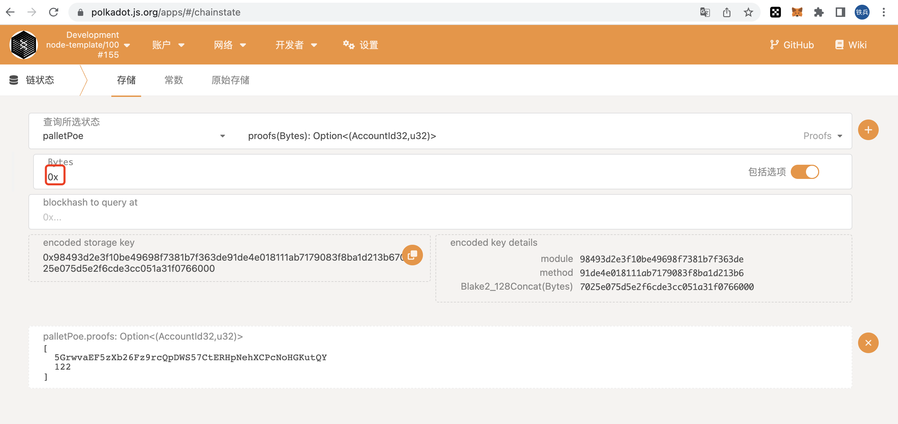
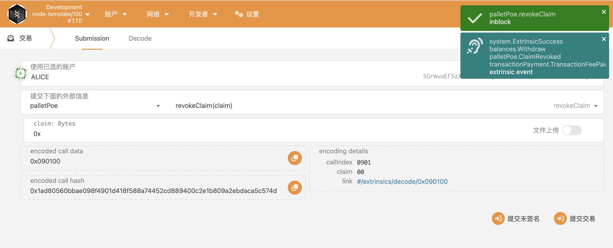
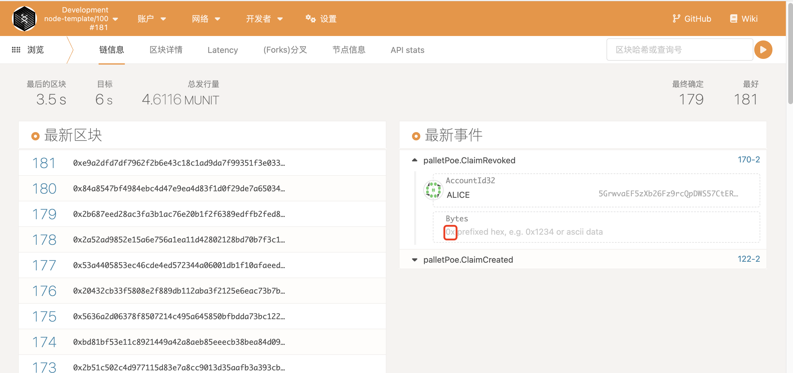
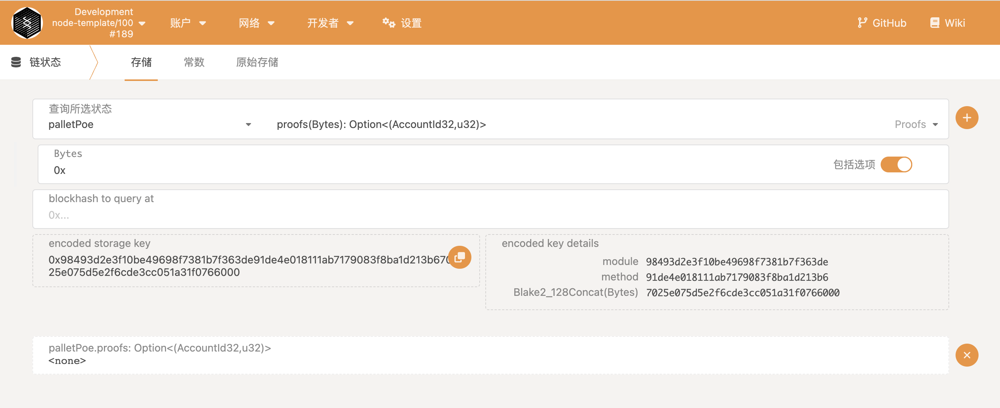
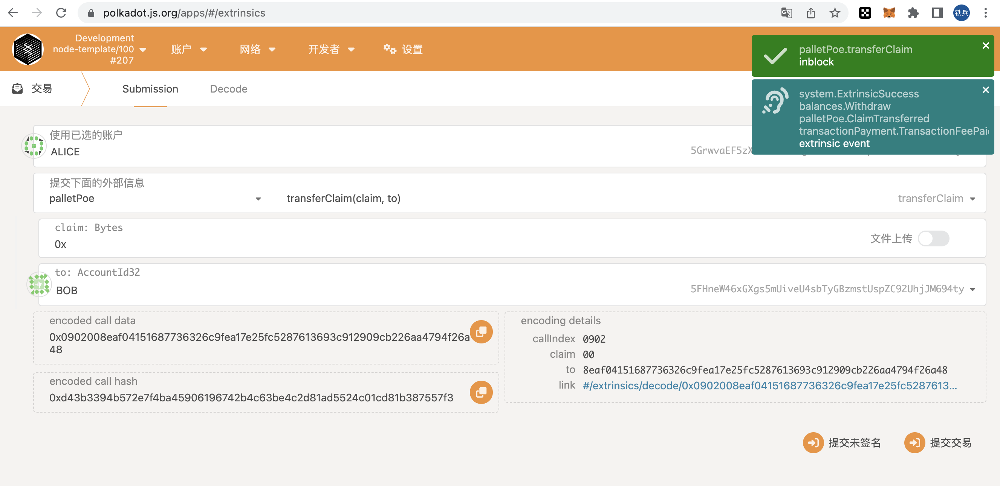
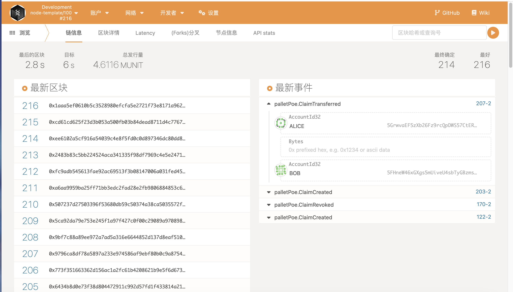
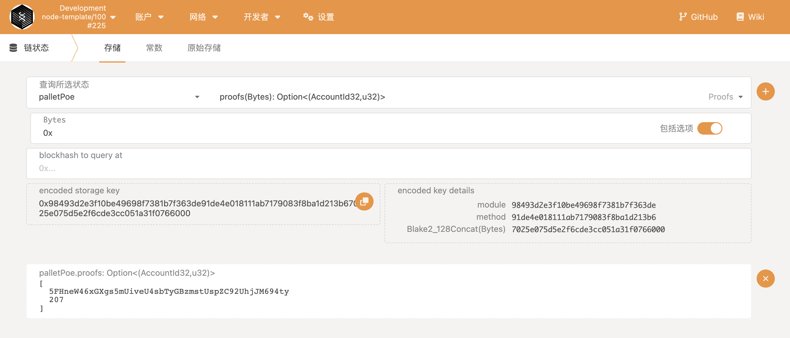

# substrate-node-poe
存证模块的功能，包括：创建存证、撤销存证、转移存证。
代码运行出块截图如下：


# 创建存证(pallets/poe/src/lib.rs:57)：

创建成功的事件：

查询创建的存证：


# 撤销存证(pallets/poe/src/lib.rs:75)：

撤销成功的事件：

查询撤销的存证：


# 转移存证(pallets/poe/src/lib.rs:93)：
Alice将存证转移给Bob

转移成功的事件：

查询存证，并且存证地址是Bob的：
