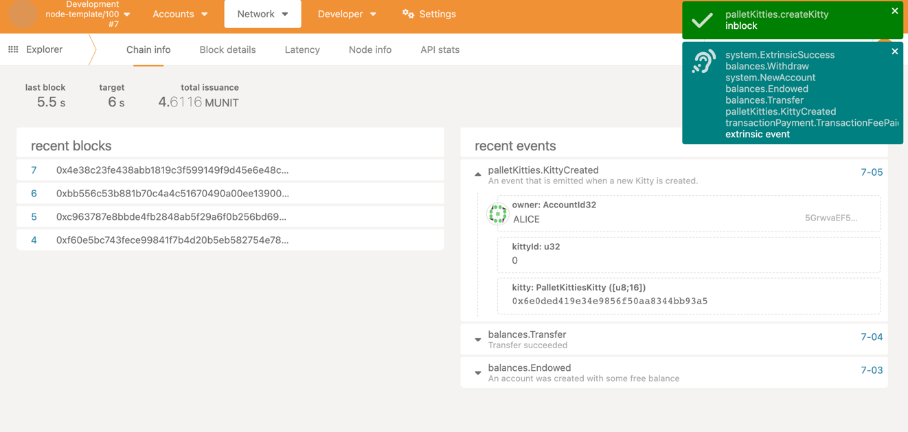
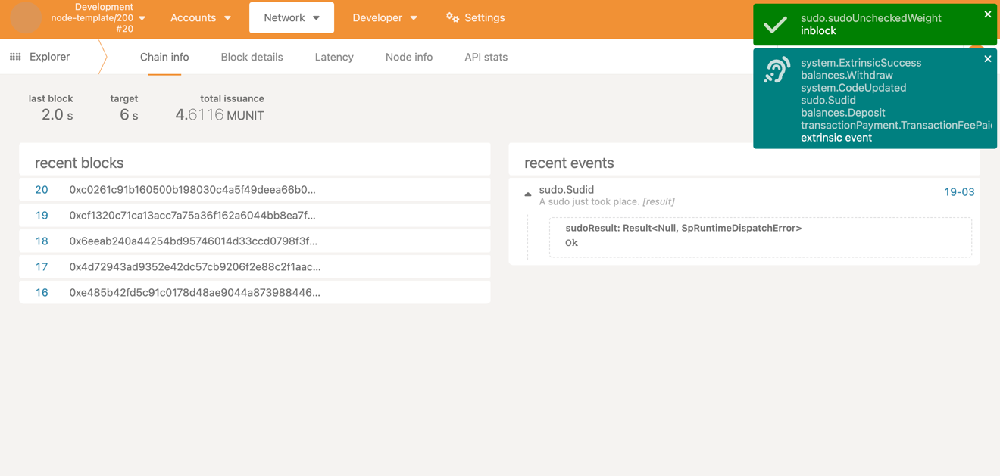
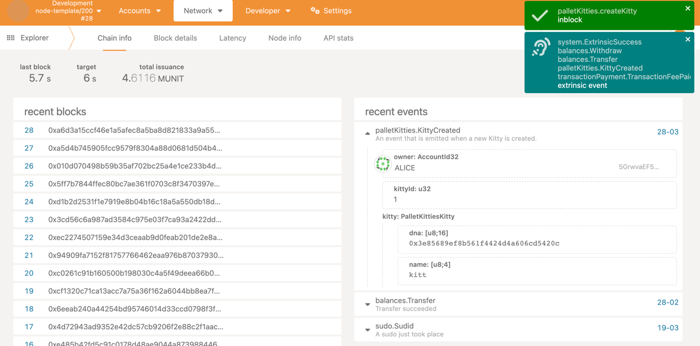
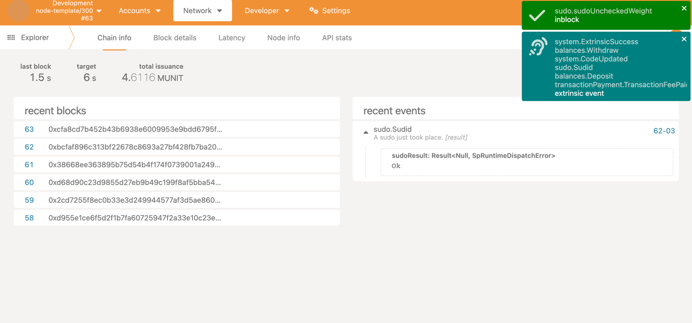
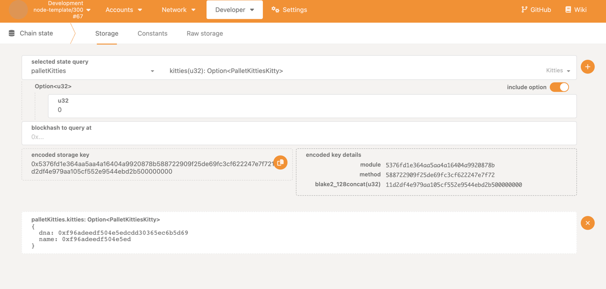
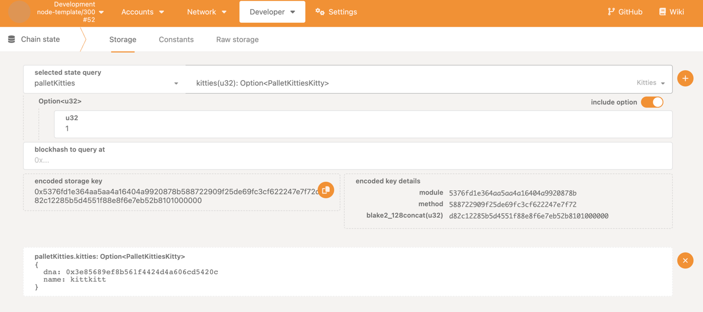
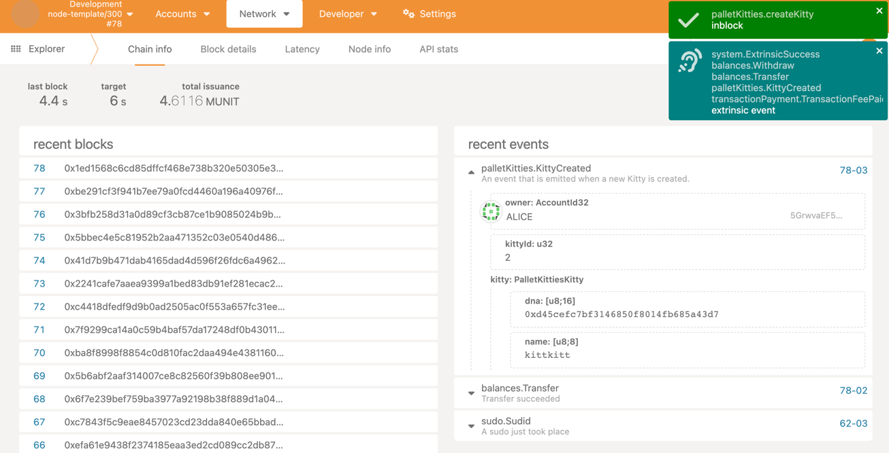
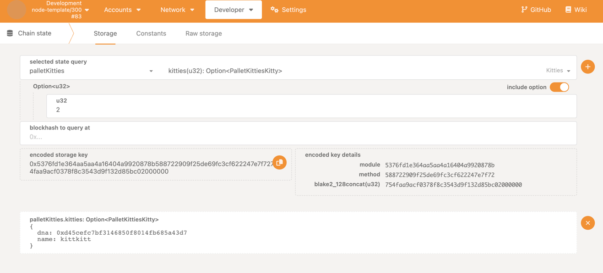

# Runtime upgrade --- v0 to v2

Creating a kitty in version 0.

Get kitty created lately in version 0.


**upgrade to version 2 from version 0 and check upgrading is successful**

Get kitty created in version 0.

Creating a kitty in version 2.

Get kitty created lately in version 2.



# Runtime upgrade --- v0 to v1 to v2

Creating a kitty in version 0.

Get kitty created lately in version 0.


**upgrade to version 1 from version 0 and check upgrading is successful**

Get kitty created in version 0.

Creating a kitty in version 1.

Get kitty created lately in version 1.


**upgrade to version 2 from version 1 and check upgrading is successful**

Get kitty created in version 0.

Get kitty created in version 1.

Creating a kitty in version 2.

Get kitty created lately in version 2.


