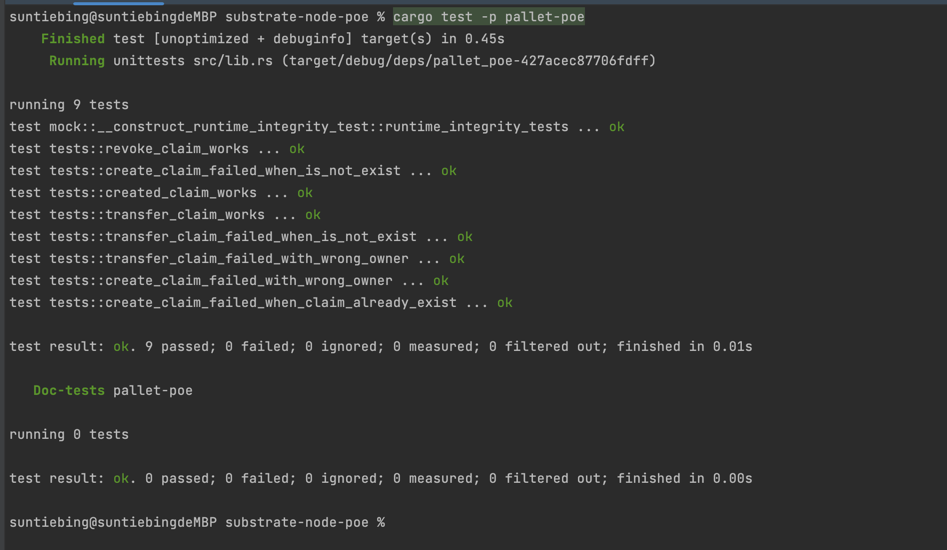

# substrate-node-poe
存证模块的功能测试用例运行截图如下：



**build and generate weights.rs file**
```shell
./target/debug/node-template benchmark pallet --chain dev --execution wasm --wasm-execution compiled --pallet pallet_poe --extrinsic "*" --steps 20 --repeat 10 --json-file=raw.json --output ./pallets/poe/src/weights.rs --template .maintain/frame-weight-template.hbs